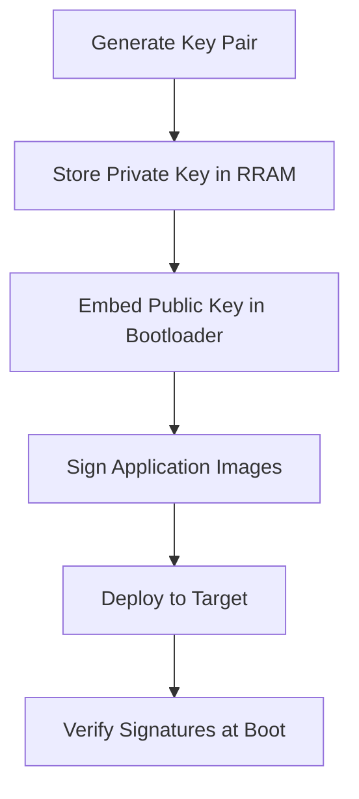

# IFX MCUboot PSE84 Middleware

## Table of Contents

- [Overview](#overview)
- [Middleware Features](#middleware-features)
- [Platform Support](#platform-support)
- [How to Use This Middleware](#how-to-use-this-middleware)
- [Architecture & Components](#architecture--components)
- [Configuration Guide](#configuration-guide) → See [PERSONALITY.md](PERSONALITY.md) for detailed personality configuration
- [Security Features](#security-features)
- [API Reference](#api-reference)
- [Troubleshooting](#troubleshooting)
- [Resources](#resources)

## Overview

The **IFX MCUboot PSE84 middleware** is an Infineon-maintained ModusToolbox library based on the [MCUboot](https://github.com/mcu-tools/mcuboot) project, specifically adapted for PSOC&trade; Edge PSE84 microcontrollers. This middleware provides the core components and APIs needed to build secure bootloader applications for PSE84 devices.

**What this middleware provides:**
- Core MCUboot libraries and platform drivers for PSE84
- EdgeProtect Bootloader configuration personality for Device Configurator
- Pre-built components for secure boot and firmware update functionality
- Integration tools for multi-core bootloader applications

**What you build with this middleware:**
- Custom bootloader applications using the provided components
- Secure firmware update systems for your PSE84 products
- Multi-core boot coordination for CM33 and CM55 applications

## Middleware Features

This middleware provides the following components for building bootloader applications:

### 🔐 Security Components
* **Secure Boot Libraries**: Cryptographic verification using ECDSA signature
* **Image Encryption Support**: AES128 encryption with hardware-accelerated operations
* **Rollback Protection**: Version-based anti-rollback mechanisms
* **Hardware Security Integration**: PSE84 secure enclave and memory protection

### 🔄 Firmware Update Components
* **Secure Update Libraries**: Support for encrypted and authenticated updates
* **Multiple Update Strategies**: SWAP/OVERWRITE mechanisms with atomic operations
* **Boot Slot Management**: Configurable primary and upgrade slot handling

### ⚡ Boot Mode Support
* **XIP (Execute-in-Place)**: Zero-copy execution from flash
* **RAM Load**: High-performance execution from SRAM
* **Multi-Core Coordination**: Support for CM33 secure/non-secure and CM55 cores
* **Custom Key Management**: User-provided ECC keys stored in Secure Enclave

### 🛠 Integration Tools
* **ModusToolbox Personality**: GUI-based configuration through Device Configurator
* **Build System Integration**: Automatic header and makefile generation
* **Platform Drivers**: PSE84-specific flash and memory abstractions

## Platform Support

### Supported Hardware
* **PSOC&trade; Edge E84 MCUs** - All PSE84 variants
* **KIT_PSE84_EVAL_EPC2** - PSOC&trade; Edge E84 Evaluation Kit
* **KIT_PSE84_EVAL_EPC4** - PSOC&trade; Edge E84 Evaluation Kit

### Supported Processors
* **ARM Cortex-M33** - Secure and Non-secure applications
* **ARM Cortex-M55** - High-performance applications

### Development Requirements
* **Development LCS** with secure_boot initially disabled for getting started
* **ModusToolbox SDK** v3.6 or later
* **Edge Protect Tools** v1.6 or later

## How to Use This Middleware

### Adding the Middleware to Your Project

#### Method 1: Using Library Manager
1. Open Library Manager in your bootloader project
2. Search for "ifx-mcuboot-pse84"
3. Select the latest version and add to your project
4. The middleware will be available in `mtb_shared/ifx-mcuboot-pse84/`

#### Method 2: Manual Integration
Add to your project's `deps/` folder or include in your `.mtb` file:
```
https://github.com/Infineon/ifx-mcuboot-pse84#latest-v1.X$$ASSET_REPO$$/ifx-mcuboot-pse84/latest-v1.X
```

### Required Dependencies

When using this middleware, ensure these libraries are included:

| Component | Version | Purpose | Makefile Entry |
|-----------|---------|---------|----------------|
| **ifx-mbedtls** | v3.6.200+ | Cryptographic operations | Auto-included |
| **core-lib** | v1.5.0+ | Common utilities | Auto-included |
| **retarget-io** | v1.8.0+ | UART debugging support | Auto-included |
| **mtb-dsl-pse8xxgp** | latest | PSE84 device support | Auto-included |

### Configuration Requirements

#### Device Configurator Setup
1. Open Device Configurator in your project
2. Enable "EdgeProtect Bootloader Configuration" personality
3. Configure memory layout, security settings, and application slots
4. Generate configuration files
5. See [PERSONALITY.md](PERSONALITY.md) for detailed configuration options

#### Required Header Includes
Your bootloader source files must include:

```c
#include "mcuboot_config.h"        /* Generated by personality */
#include "bootutil/bootutil.h"     /* Core MCUboot APIs */
#include "bootutil/bootutil_log.h" /* Logging support */
```

### Multi-Project Integration

For projects that need to integrate bootloader with application projects:

#### Build Configuration Requirements

```makefile
# Enable multi-project build
MTB_PROJECTS=proj_cm33_s proj_cm33_ns proj_cm55 proj_bootloader
```

```makefile
# Configure signing integration
COMBINE_SIGN_JSON?=./bsps/TARGET_$(TARGET)/config/GeneratedSource/boot_with_bldr.json
```

```makefile
# Set linker script for bootloader
LINKER_SCRIPT=$(MTB_TOOLS__TARGET_DIR)/COMPONENT_$(CORE)/TOOLCHAIN_$(TOOLCHAIN)/bootloader.$(LINKER_SCRIPT_EXT)
```

### Required Project Structure

When integrating this middleware into your bootloader project, ensure the following structure:

```
your_bootloader_project/
├── main.c                    /* Your bootloader implementation */
├── Makefile                  /* With required COMPONENTS */
├── config/                   /* Device Configurator output */
│   └── GeneratedSource/
│       ├── mcuboot_config.h  /* Generated by personality */
│       ├── memorymap.h       /* Memory layout definitions */
│       └── *.json           /* Build integration files */
├── deps/                     /* Dependencies (auto-managed) */
├── libs/                     /* Library cache */
└── build/                    /* Build output */
```

### Minimum Implementation Requirements

Your bootloader project must implement these functions:

```c
#include "mcuboot_bootloader.h"

int main(void)
{
    /* Initialize some peripheral */


    /* Enable global interrupts */
    __enable_irq();

    bootloader_init();
    bootloader_run();

    for (;;)
    {
    }
}
```

### Configuration File Integration

The middleware generates these files that must be integrated into your project:

| Generated File | Location | Purpose | Integration Method |
|----------------|----------|---------|-------------------|
| `mcuboot_config.h` | `config/GeneratedSource/` | MCUboot configuration macros | `#include "mcuboot_config.h"` |
| `memorymap.h/.c` | `config/GeneratedSource/` | Memory layout definitions | Auto-included by middleware |
| `feature_config.mk` | `config/GeneratedSource/` | Makefile configuration | `include ./config/GeneratedSource/feature_config.mk` |
| `boot_with_bldr.json` | `config/GeneratedSource/` | Multi-image signing | Used by build system |

#### Memory Layout Coordination
- Use the same Device Configurator personality settings across all projects
- Ensure application linker scripts match the generated memory map
- Coordinate memory regions between bootloader and application slots

### Toolchain Compatibility

| Compiler | Version | Support Level |
|----------|---------|---------------|
| **GNU Arm Embedded** | v14.2.1 | ✅ Full support (default) |
| **Arm Compiler** | v6.22 | ✅ Full support |
| **IAR C/C++ Compiler** | v9.50.2 | ✅ Full support |

## Architecture & Components

### Middleware Architecture

The ifx-mcuboot-pse84 middleware provides a layered architecture for building bootloader applications:

```
Your Bootloader Application
├── MCUboot Core APIs (bootutil_*)
├── Platform Integration Layer (PSE84)
├── Security Components (signatures, encryption)
└── Hardware Abstraction (flash, memory)
```

### Boot Chain Integration

Your bootloader application fits into the PSE84 boot chain:

```
Power-On → Secure Enclave → Extended Boot → Your Bootloader Application → Target Applications
```

1. **Secure Enclave**: Hardware root of trust (not user-modifiable)
2. **Extended Boot**: System initialization (not user-modifiable)
3. **Your Bootloader Application**: Built using this middleware
4. **Target Applications**: Your CM33_S, CM33_NS, and CM55 applications

### Middleware Components

#### Boot Utilities Library (`boot/bootutil/`)
**Purpose**: Core MCUboot functionality
- **Image Management**: Header validation, signature verification, integrity checking
- **Encryption/Decryption**: AES128 encryption for XIP and RAMLOAD modes
- **Memory Management**: Flash map abstraction and memory region handling
- **Boot Slot Management**: Primary/upgrade slot coordination with metadata
- **Swap Operations**: Atomic image swapping with scratch area support
- **Security Features**: Anti-rollback protection and fault injection hardening

#### Platform Integration (`boot/platforms/COMPONENT_PSE84/`)
**Purpose**: PSE84-specific platform drivers
- **Flash Map Backend**: PSE84-specific flash memory abstraction
- **Platform Initialization**: Hardware setup and security configuration
- **Key Management**: Secure key storage in Secure Enclave
- **Memory Components**: Support for RRAM, SRAM, and SMIF flash memories
- **XIP Encryption**: Execute-in-place encryption/decryption acceleration

#### Configuration System (`device-info/personalities_14.0/`)
**Purpose**: GUI-based configuration interface
- **EdgeProtect Bootloader Personality**: Comprehensive bootloader setup through Device Configurator
- **Memory Map Generation**: Automated memory layout
- **Security Parameters**: Encryption key paths and signature validation
- **Build Integration**: Auto-generation of headers, makefiles, JSON files

*For detailed personality configuration information, see [PERSONALITY.md](PERSONALITY.md)*

### Supported Capabilities

#### Cryptographic Support
| Feature | Algorithm | Key Size | Description |
|---------|-----------|----------|-------------|
| **Digital Signatures** | ECDSA | P-256 | Elliptic curve signatures |
| **Encryption** | AES | 128-bit | Symmetric encryption |
| | ECC | P-256 | Elliptic curve encryption |
| **Hashing** | SHA | 256-bit | Cryptographic hash verification |

#### Upgrade Strategies
| Strategy | Description | Use Case |
|----------|-------------|----------|
| **OVERWRITE_UPGRADE** | Direct replacement of primary image | Simple, fast updates |
| **SWAP_USING_SCRATCH** | Atomic swapping with scratch area | Safe, rollback capable |

#### Boot Modes
| Mode | Description | Use Case |
|------|-------------|----------|
| **DIRECT_XIP** | Execute-in-place from upgrade slot | No copy overhead |
| **RAM_LOAD** | Load and execute from RAM | High-performance execution |

#### Security Features
| Feature | Description | Benefit |
|---------|-------------|---------|
| **VALIDATE_PRIMARY_SLOT** | Boot-time validation of primary images | Integrity assurance |
| **VALIDATE_SECONDARY_SLOT** | Boot-time validation of secondary images | Integrity assurance |
| **DOWNGRADE_PREVENTION** | Anti-rollback protection mechanism | Security maintenance |
| **BOOTSTRAP** | Secure bootstrap capability | Initial secure setup |
| **FAULT_INJECTION_HARDENING** | Protection against fault attacks | Attack resistance |

## Configuration Guide

For detailed information about configuring the EdgeProtect Bootloader using the ModusToolbox Device Configurator personality, see [PERSONALITY.md](PERSONALITY.md).

## Security Features

### Image Authentication & Integrity

#### Digital Signature Support
| Algorithm | Key Size | Use Case | Performance |
|-----------|----------|----------|-------------|
| **ECDSA** | P-256 | Modern applications | High security, faster |
| **SHA-256** | 256-bit hash | Integrity verification | Fast verification |

#### Image Encryption
| Mode | Algorithm | Key Management | Description |
|------|-----------|----------------|-------------|
| **XIP Single Key** | AES128 + ECIES P-256 | RRAM storage | Execute-in-place encryption |
| **XIP Multi Key** | AES128 per image | Individual keys | Per-image key isolation |
| **Custom ECC Keys** | User-provided ECDSA | Secure provisioning | Production key management |

### Update Security

#### Update Strategies
| Strategy | Security Level | Rollback Safety | Performance |
|----------|----------------|-----------------|-------------|
| **OVERWRITE** | Medium | ⚠️ Limited | ⚡ Fast |
| **SWAP** | High | ✅ Full protection | 🔄 Moderate |
| **Encrypted Updates** | Maximum | ✅ Full protection | 🔄 Moderate |

#### Anti-Rollback Protection
- **Hardware Security Counters**: Monotonic counters in secure hardware
- **Version Validation**: Software version checking and enforcement
- **Measured Boot**: Cryptographic attestation of boot chain
- **Dependency Checking**: Inter-image version compatibility validation

### Key Management

#### Storage Locations
| Key Type | Storage | Address | Security |
|----------|---------|---------|----------|
| **Private ECC Keys** | RRAM | User-defined | Hardware protected |
| **AES Data Keys** | File system | User-defined | Build-time encryption |
| **Public Keys** | Application | Embedded | Code signing verification |
| **Provisioned Keys** | Secure storage | Hardware managed | Production deployment |

#### Key Provisioning Workflow


## API Reference

The ifx-mcuboot-pse84 middleware provides these APIs for building your bootloader application:

### Primary Bootloader APIs

#### Initialization and Main Loop
```c
/**
 * Initialize bootloader subsystems and hardware
 * Call this first in your bootloader main() function
 * @return 0 on success, error code on failure
 */
int bootloader_init(void);

/**
 * Execute main bootloader logic
 * This handles image validation, selection, and boot
 * @return 0 on success, error code on failure
 */
int bootloader_run(void);
```

#### Core MCUboot APIs
```c
/**
 * Main boot logic execution with image selection
 * Lower-level API for custom boot logic implementation
 * @param rsp Boot response structure containing boot information
 * @return 0 on successful boot, error code on failure
 */
int boot_go(struct boot_rsp *rsp);
```

### Logging System

Use these APIs for debugging your bootloader application:

#### Log Levels
```c
#define MCUBOOT_LOG_ERR   1  /* Error-level messages for critical failures */
#define MCUBOOT_LOG_WRN   2  /* Warning messages for non-critical issues */
#define MCUBOOT_LOG_INF   3  /* Informational messages for normal operation */
#define MCUBOOT_LOG_DBG   4  /* Debug-level detailed execution information */
```

#### Logging Functions
```c
/**
 * Log messages with different severity levels
 * Output goes to UART at 115200 baud (configured via retarget-io)
 * Include these in your bootloader for debugging
 */
void MCUBOOT_LOG_ERR(const char *fmt, ...);
void MCUBOOT_LOG_WRN(const char *fmt, ...);
void MCUBOOT_LOG_INF(const char *fmt, ...);
void MCUBOOT_LOG_DBG(const char *fmt, ...);
```

## Troubleshooting

### Common Integration Issues

#### 🔧 Middleware Integration Problems

| Problem | Symptoms | Solution |
|---------|----------|----------|
| **Library Not Found** | Build errors: "ifx-mcuboot-pse84 not found" | Use Library Manager to add middleware, or check .mtb file |
| **Missing Components** | Link errors for MCUboot symbols | Add required COMPONENTS to Makefile (see Integration Reference) |
| **Personality Missing** | EdgeProtect option not in Device Configurator | Ensure EDGEPROTECT_BOOTLOADER_PERSONALITY component is included |
| **Header Not Found** | Compile error: mcuboot_config.h missing | Run Device Configurator to generate configuration files |

#### 🏗 Configuration Issues

| Problem | Symptoms | Solution |
|---------|----------|----------|
| **Memory Overlap** | Build errors, runtime crashes | Check personality memory layout - ensure slots don't overlap |
| **Insufficient Space** | Image too large errors | Increase bootloader region size in personality configuration |
| **Key Path Errors** | Signing failures | Verify key file paths are relative to JSON file location |
| **Missing Regions** | Configuration validation errors | Create all required memory regions in personality before building |

#### 🔐 Bootloader Application Issues

| Problem | Symptoms | Solution |
|---------|----------|----------|
| **Boot Hangs** | No debug output, system frozen | Check boot_go() return value, enable debug logging |
| **Signature Verification Failed** | Bootloader refuses to start application | Verify key pairs match between bootloader and application signing |
| **Application Won't Start** | Bootloader completes but application doesn't run | Check application entry point matches configured memory layout |
| **Multi-core Coordination** | Only one core starts | Verify all images are properly configured and signed |

#### 📋 Hardware Configuration Issues

| Problem | Symptoms | Solution |
|---------|----------|----------|
| **Boot Switch Position** | No boot from RRAM | Set boot switch to 'Low'/OFF position |
| **Jumper Configuration** | Programming issues | Set J20/J21 to Tristate/NC position |
| **Serial Output Missing** | No debug logs | Configure terminal: 115200 baud, 8N1, check retarget-io |
| **KitProg3 Not Detected** | Programming fails | Check USB connection, install KitProg3 drivers |

### Debugging Your Bootloader Application

#### Enable Debug Logging
Add to your bootloader main.c:
```c
#include "bootutil/bootutil_log.h"
```

#### Debug Tools
- **ModusToolbox Debugger**: Set breakpoints in your bootloader code
- **Serial Terminal**: Monitor real-time logs at 115200 baud
- **Memory Viewer**: Inspect flash areas and key storage
- **Device Configurator**: Validate personality configuration before building

## Resources

### 📚 Documentation

#### Official Infineon Resources
| Resource | Type | Description |
|----------|------|-------------|
| **PSOC Edge Protect Bootloader Application Note** | Application Note | Comprehensive usage guide and implementation details |
| **Getting Started with PSOC Edge E84** | Quick Start | Platform introduction and setup guide |
| [**PSOC Edge E84 Documentation**](https://www.infineon.com/products/microcontroller/32-bit-psoc-arm-cortex/32-bit-psoc-edge-arm/psoc-edge-e84#Documents) | Technical Docs | Device datasheets and reference manuals |
| [**ModusToolbox Software Environment**](https://www.infineon.com/modustoolbox) | Development Tools | IDE and development environment |

#### Upstream & Community Resources
| Resource | Type | Description |
|----------|------|-------------|
| [**MCUboot GitHub Repository**](https://github.com/mcu-tools/mcuboot) | Source Code | Official MCUboot source code and issues |
| [**Trusted Firmware-M**](https://www.trustedfirmware.org/projects/tf-m/) | Security Framework | PSA compliance and security architecture |

### 🛠 Development Tools

#### ModusToolbox Ecosystem
| Tool | Purpose | Key Features |
|------|---------|--------------|
| **Device Configurator** | Hardware setup | Memory regions, pin configuration, personality setup |
| **Personality Manager** | Bootloader config | EdgeProtect Bootloader personality interface |
| **Project Creator** | Project setup | Template projects and code examples |
| **Library Manager** | Dependencies | Manage MCUboot and related libraries |

#### External Tools
| Tool | Purpose | Usage |
|------|---------|--------|
| **CySecureTools** | Security operations | Key generation, image signing, provisioning |
| **Signer-Combiner** | Image processing | Multi-image signing and combination |
| **OpenOCD** | Debugging | JTAG/SWD debugging and programming |

### 💬 Support Channels
| Channel | Type | Best For |
|---------|------|----------|
| [**Infineon Developer Community**](https://community.infineon.com/) | Forum | General questions, troubleshooting, community help |
| [**ModusToolbox Community**](https://community.infineon.com/t5/ModusToolbox/ct-p/ModusToolbox) | Specialized Forum | Tool-specific questions and tips |
| [**GitHub Issues**](https://github.com/Infineon/mtb-example-psoc-edge-protect-bootloader/issues) | Issue Tracker | Bug reports and feature requests |

---

### 📄 License & Copyright

**© Cypress Semiconductor Corporation (an Infineon company) or an affiliate of Cypress Semiconductor Corporation, 2023-2025.**

This documentation and associated software are provided under the terms of the [Infineon Software License Agreement](https://www.infineon.com/cms/en/about-infineon/company/legal/terms-of-use/software-license-agreement/).

For open-source components, refer to individual component licenses in the respective directories.

---

*Last updated: September 2025 | Document version: 1.2*