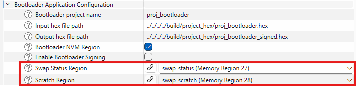
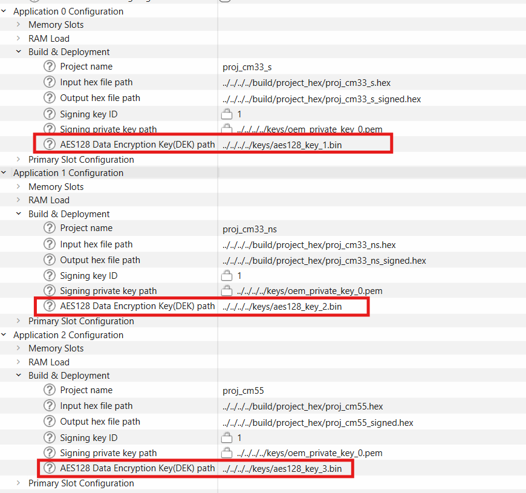

# IFX MCUboot PSE84 Middleware

## Table of Contents

- [Overview](#overview)
- [Additional links](#additional-links)
- [Middleware Features](#middleware-features)
- [Platform Support](#platform-support)
- [Architecture & Components](#architecture--components)
- [How to Use](#how-to-use)
- [Configuration Guide](#configuration-guide)

## Overview

The **IFX MCUboot PSE84 middleware** is an Infineon-maintained ModusToolbox library based on the [MCUboot](https://github.com/mcu-tools/mcuboot) project, specifically adapted for PSOC&trade; Edge PSE84 microcontrollers. This middleware provides the core components and APIs needed to build secure bootloader applications for PSE84 devices.

## Additional links

For more information on how to use ifx-mcuboot with Edge Protect Bootloader, refer to the following documents:

* [Edge Protect Bootloader for PSOC™ Edge](https://www.infineon.com/AN237857)

For more information on how to use the Edge Protect Bootloader Solution Personality, refer to the following documents:

* [Edge Protect Bootloader Solution Personality](PERSONALITY.md)

## Middleware Features
### Upgrade Strategies
- **Overwrite Only** - Simple direct image replacement, does not allow reverting if the new image does not work.
- **Swap Using Scratch with Swap Status** - Safe atomic updates with dedicated scratch area, allows performing safe upgrades and reverts if the new image does not start. Use of the Swap Status algorithm allows using ifx-mcuboot with "big write size" memory types.
- **Shared secondary slot** - All images have a single common upgrade slot.


### Boot Modes
- **Single Image** - Traditional single-application boot.
- **Multi Image** - Support for multiple independent firmware images.
- **RAM Loading** - Copy the image to RAM before execution.

### Image Authentication
- **ECDSA** - P-256, elliptic curve signatures via SE RT services.
- **Hash Verification** - SHA-256 integrity check via SE RT services.

### Image Encryption
- **AES Encryption** - AES-128 symmetric encryption.
- **ECIES** - Elliptic Curve Integrated Encryption Scheme
- **Encrypted primary slots** - Boot from encrypted primary slots with SMIF XIP "on-the-fly" decryption.

### Anti-Rollback Protection
- **Hardware Security Counters* - Monotonic counter validation.
- **Measured Boot** - TPM-style boot measurements.
- **Downgrade Prevention** - Configurable rollback protection.

### Extra features
- **SE RAMApp Staging** - Staging of RAM applications for boot code.
- **Dependency check** - Enables coordinated multi-image updates by validating version dependencies between different firmware images before allowing upgrades.


## Platform Support

### Supported Hardware
* **PSOC&trade; Edge E84 MCUs** - All PSE84 variants

### Supported Processors
* **ARM Cortex-M33** - Secure and Non-secure applications

## Architecture & Components

### Middleware Architecture

The ifx-mcuboot-pse84 middleware provides a layered architecture for building bootloader applications:

```
Your Bootloader Application
├── MCUboot Core APIs (bootutil_*)
├── Platform Integration Layer (PSE84)
├── Security Components (signatures, encryption)
└── Hardware Abstraction (flash, memory)
```

### Middleware Components

#### Boot Utilities Library (`boot/bootutil/`)
**Purpose**: Core MCUboot functionality
- **Image Management** - Header validation, signature verification, integrity check.
- **Encryption/Decryption** - AES128 encryption for XIP and RAMLOAD modes.
- **Memory Management** - Flash-map abstraction and memory-region handling.
- **Boot Slot Management** - Primary/upgrade slot coordination with metadata.
- **Swap Operations** - Atomic image swapping with scratch area support
- **Security Features** - Anti-rollback protection and fault injection hardening.

#### Platform Integration (`boot/platforms/COMPONENT_PSE84/`)
**Purpose** - PSE84-specific platform drivers.
- **Flash Map Backend** - PSE84-specific flash memory abstraction.
- **Platform Initialization** - Hardware setup and security configuration.
- **Key Management** - Secure key storage in Secure Enclave
- **Memory Components** - Support for RRAM, SRAM, and SMIF flash memories.
- **XIP Encryption** - Execute-in-place encryption/decryption acceleration.

#### Configuration System (`device-info/personalities_14.0/`)
**Purpose** - GUI-based configuration interface.
- **EdgeProtect Bootloader Personality** - Comprehensive bootloader setup through the Device Configurator.
- **Memory Map Generation** - Automated memory layout.
- **Security Parameters** - Encryption key paths and signature validation.
- **Build Integration** - Auto-generation of headers, makefiles, JSON files.

*For detailed information on personality configuration, see [PERSONALITY.md](PERSONALITY.md).*

## How to Use
ifx-mcuboot is a middleware library integrated with ModusToolbox(TM) that contains the bootloader solution personality to configure memory maps and features. This library is expected to be used with ModusToolbox(TM) applications.

### Required Project Structure

When integrating this middleware into your bootloader project, ensure the following structure:

```
your_bootloader_project/
├── main.c                    /* Your bootloader implementation */
├── Makefile                  /* With required COMPONENTS */
├── config/                   /* Device Configurator output */
│   └── GeneratedSource/
│       ├── mcuboot_config.h  /* Generated by personality */
│       ├── memorymap.h       /* Memory layout definitions */
│       └── *.json           /* Build integration files */
├── deps/                     /* Dependencies (auto-managed) */
├── libs/                     /* Library cache */
└── build/                    /* Build output */
```

### Adding the Middleware to Your Project

#### Method 1: Use Library Manager
1. Open Library Manager in your project.
2. Search for "ifx-mcuboot-pse84".
3. Select the latest version and add to your project.
4. The middleware will be available in `mtb_shared/ifx-mcuboot-pse84/`.

#### Method 2: Add via `.mtb` dependency file
Add to your project's `deps/` folder or include in your `.mtb` file with content:
```
https://github.com/Infineon/ifx-mcuboot-pse84#latest-v1.X$$ASSET_REPO$$/ifx-mcuboot-pse84/latest-v1.X
```
### Minimum Implementation Requirements

The bootloader_init() and bootloader_run() are high-level public functions that must be called from the bootloader application.

Your bootloader project must have the following code:

*main.c*
```c
#include "mcuboot_bootloader.h"

int main(void)
{
    /* HW initialization, user code */

    bootloader_init();
    bootloader_run();

    /* Unreachable code. The bootloader_run() passes control to the next app
       or gets stuck in the Error Handler */
}
```
### Configure Signer Combiner

The personality generates signer combiner config JSON files:
- `"boot_with_bldr.json"` for boot images
- `"boot_with_bldr_upgr.json"` for upgrade images.

**For Boot Slots (Development)** - Add to Makefile:
```makefile
# Sign bootloader and user boot slots
COMBINE_SIGN_JSON?=bsps/TARGET_$(TARGET)/config/GeneratedSource/boot_with_bldr.json
```

**For Upgrade Slots (Production)** - Add to Makefile:
```makefile
# Sign user upgrade slots
COMBINE_SIGN_JSON?=bsps/TARGET_$(TARGET)/config/GeneratedSource/boot_with_bldr_upgr.json
```

### Linker Scripts
BSPs contain linker scripts for the bootloader project. Update the Makefile:

```makefile
# Set linker script for bootloader
# Specify the path to the linker script to use
ifneq (,$(filter $(TOOLCHAIN),GCC_ARM))
    LINKER_SCRIPT_EXT:=ld
else ifeq ($(TOOLCHAIN),ARM)
    LINKER_SCRIPT_EXT:=sct
else ifeq ($(TOOLCHAIN),IAR)
    LINKER_SCRIPT_EXT:=icf
endif
LINKER_SCRIPT=../bsps/TARGET_$(TARGET)/COMPONENT_$(CORE)/TOOLCHAIN_$(TOOLCHAIN)/bootloader.$(LINKER_SCRIPT_EXT)
```

## Configuration Guide

The configuration of the ifx-mcuboot middleware is performed via the Edge Protect Bootloader Solution personality.
The personality is an extension of the Device Configurator that allows configuring all ifx-mcuboot and bootloader parameters via a GUI interface.


- Enable Edge Protect Bootloader Solution Personality

     

   - Send a request to the memory configurator to allocate Bootloader NVM region.

     

   - Open Memory Regions and set the bootloader_nvm region offset = 0x11000.

     

   - Create upgrade memory regions (upgrade slots) for each application project.

     

   - Configure boot and upgrade slots for each application project.

     

   - Set paths to hex files for bootloader and user projects.

     

   - Configure the required MCUboot and bootloader features(See examples below) and save.

     


The Save action in the Device Configurator generates configuration files:

 - `"memorymap.c"`, `"memorymap.h"` - Contains information about the memory and image slots.
 - `"mcuboot_config.h"` - Contains information about the selected mcuboot parameters.
 - `"feature_config.mk"` - Contains information about the components and selected mcuboot parameters that are not included in `"mcuboot_config.h"`.
 - `"boot_with_bldr.json"` - A signer combiner config JSON file for boot images.
 - `"boot_with_bldr_upgr.json"` - A signer combiner config JSON file for upgrade images.

For detailed information on the Edge Protect Bootloader Solution personality and all parameters, see [PERSONALITY.md](PERSONALITY.md).

###  Configure image validation

1. **Enable validation** - On the Solution tab in the Edge Protect Bootloader Solution Personality, add "Validate boot slot" and "Validate upgrade slot".

   

2. **Set common signing key** - Set the common signing private key. The bootloader supports image signature validation with the OEM RoT key. The key ID is always = 1.

   

3. **Save the personality**.

   

###  OCTAL memory support on PSE84 EVK

1. **Enable OCTAL interface** - Enable SPI Data[4] - SPI Data[7] and SPI Slave Select 0 for Quad Serial Memory interface 0. Enable internal DLL:

   

2. **Remove existing regions** - Remove all app regions from the "Serial Memory S25FS128S" section in "Memory Regions":

   

3. **Configure OCTAL memory** - Configure S28HS01GT (Octal SPI memory) on Slave Slot 0 and disable Slave Slot 1 with Quad SPI memory S25FS128S. Select "Octal DDR Hybrid at Bottom 25 MHz":

   

4. **Configure memory regions** - Configure memory regions for S28HS01GT:

   

5. **Choose memory for primary slots**:

   

   

   

### Upgrade using SWAP

1. **Set upgrade mode** - In the Bootloader Solution personality, in the MCUBoot configuration, set "Upgrade mode" to swap:

   

2. **Create scratch and status regions**:
   - **Create swap_status region** in RRAM memory only. The other memory types are not supported for the swap status region:

     

   - **Create swap_scratch region** in external memory:

     

   - **Overall memory configuration**:

     

3. **Select regions** - Open the Solution personality and select regions for the swap status and swap scratch created in the previous step:

   

 ###  Dependency check

1. **Enable dependency check** - On the Solution tab in the Edge Protect Bootloader Solution Personality, add "Dependency check":

   

2. **Set image versions** - For **each** image, set the image version using the following format: "major", "minor", "patch":

   

3. **Set dependencies** - Set the image dependencies in the format: (image_ID, image_version) where image_ID is the ID on which this image depends. It starts from 0. One image can depend on several other images. e.g., (1, 1.1.0), (2, 2.0.0):

   


###  Downgrade prevention. HW rollback protection

1. **Enable HW rollback protection** - On the Solution tab in the Edge Protect Bootloader Solution Personality, add "HW rollback protection":

   

2. **Configure security counters** - Set "HW security counter number" and "HW security counter value". You can change "HW security counter number" in the range 2-15 for PSE84 EPC4 devices and in the range 2-15 for PSE84 EPC2 devices. You can change "HW security counter value" in the range 1-63 for counters 2-7 and in the range 1-32767 for counters 8-15:

   

### XIP Encryption with single key. (for OVERWRITE upgrade only)

1. **Enable validation** - On the Solution tab in the Edge Protect Bootloader Solution Personality, add "Validate boot slot" and "Validate upgrade slot":

   

2. **Set common signing private key** - The bootloader supports the image signature validation with the OEM RoT key. the key ID is always = 1:

   

3. **Set encryption mode** - Set encryption mode "XIP encryption single AES key (+ ECIES P256)":

   

4. **Create region for private key encryption key** (kek_region) in RRAM:

   

5. **Set path to public key encryption key**:

   

#### Key Generation and Programming

The key pair can be generated and converted to the DER-PKCS8 format by edgeprotecttools:

##### 5.1 Generate a ECC key pair in the PEM format:
```bash
edgeprotecttools create-key --key-type ECDSA-P256 --output gen_private_key.pem gen_public_key.pem
```

##### 5.2 Convert the PEM private key to DER-PKCS8 format and store to the bin file:
```bash
edgeprotecttools convert-key -k gen_private_key.pem -o gen_private_key.bin -f DER-PKCS8
```

##### 5.3 Program the private key to the device by openocd at the start address of the "kek_region":
```bash
openocd.exe -s scripts -f interface/kitprog3.cfg -f target/infineon/pse84xgxs2.cfg -c "init; reset init; flash write_image gen_private_key.bin <kek_region_start address>; reset; shutdown"
```

6. **Set AES128 key** - By default, the key aes128_key.bin will be used:

   

   The AES key can be generated by edgeprotecttools:

   ```bash
   edgeprotecttools create-key --key-type AES128 --output gen_aes_key.bin
   ```

7. **Set path to auto-generated nonce file** - By default, the key nonce.bin will be used:

   

### XIP Encryption with multi keys. SWAP & OVERWRITE

1. **Enable validation** - On the Solution tab in the Edge Protect Bootloader Solution Personality, add "Validate boot slot" and "Validate upgrade slot":

   

2. **Set common signing private key** - The bootloader supports the image signature validation with the OEM RoT key. The key ID is always = 1:

   

3. **Set encryption mode** - Set encryption mode "XIP encryption multi AES keys (+ ECIES P256)":

   

4. **Create region for private key encryption key** (kek_region) in RRAM:

   

   

5. **Set path to public key encryption key**:

   

#### Key Generation and Programming

The key pair can be generated and converted to the DER-PKCS8 format by edgeprotecttools:

##### 5.1 Generate an ECC key pair in the PEM format:
```bash
edgeprotecttools create-key --key-type ECDSA-P256 --output gen_private_key.pem gen_public_key.pem
```

##### 5.2 Convert the PEM private key to the DER-PKCS8 format and store to the bin file:
```bash
edgeprotecttools convert-key -k gen_private_key.pem -o gen_private_key.bin -f DER-PKCS8
```

##### 5.3 Program the private key to the device by openOCD at the start address of the "kek_region":
```bash
openocd.exe -s scripts -f interface/kitprog3.cfg -f target/infineon/pse84xgxs2.cfg -c "init; reset init; flash write_image gen_private_key.bin <kek_region_start address>; reset; shutdown"
```

6. **Set AES128 key for each image**:

   

   The random AES key for each image can be generated by edgeprotecttools:

   ```bash
   edgeprotecttools create-key --key-type AES128 --output gen_aes_key.bin
   ```

7. **Configure memory requirements** - The multi key XIP encryption has strict requirements for the encryption region size and start address. The size must be a perfect power-of-two number. The start address must be a multiple of the size number: start_address = N * size. To meet these requirements, update the Hello World project memory regions. In the example below, all images have the size = 0x100000:

   

### 📄 License & Copyright

**© Cypress Semiconductor Corporation (an Infineon company) or an affiliate of Cypress Semiconductor Corporation, 2023-2025.**

This documentation and associated software are provided under the terms of the [Infineon Software License Agreement](https://www.infineon.com/cms/en/about-infineon/company/legal/terms-of-use/software-license-agreement/).

For open-source components, refer to individual component licenses in the respective directories.

---

*Last updated: October 2025 | Document version: 1.3*
